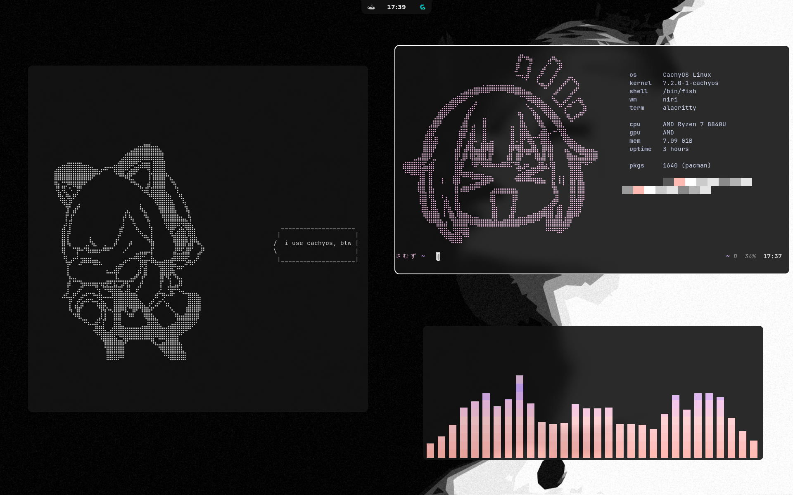

# samuz dotfiles

My personal Linux rice setup with **niri** + **noctalia** + **fish** + **starship**.

## Preview

```
samuz

os      CachyOS Linux
kernel  7.2.0-1-cachyos
shell   /bin/fish
wm      niri
term    alacritty

cpu     AMD Ryzen 7 8840U
gpu     AMD
mem     4.23 GiB
uptime  0

pkgs    0
```

<p align="center">
  
</p>

## Stack

| Component | Tool |
|-----------|------|
| Compositor | [niri](https://github.com/YaLTeR/niri) |
| Shell | [fish](https://fishshell.com/) |
| Prompt | [starship](https://starship.rs/) |
| Theme | [noctalia](https://noctalia.dev) |
| Terminal | [alacritty](https://github.com/alacritty/alacritty) |
| System Monitor | [btop](https://github.com/aristocratos/btop) |
| App Launcher | [fuzzel](https://codeberg.org/dnkl/fuzzel) |
| Git TUI | [lazygit](https://github.com/jesseduffield/lazygit) |
| System Info | [fastfetch](https://github.com/fastfetch-cli/fastfetch) |
| Audio Visualizer | [cava](https://github.com/karstensensensen/cava) |

## Included Configs

```
dotfiles/
├── niri/              # Niri compositor config
│   ├── config.kdl
│   ├── noctalia.kdl   # Noctalia theme integration
│   └── cfg/
│       ├── animation.kdl
│       ├── autostart.kdl
│       ├── display.kdl
│       ├── input.kdl
│       ├── keybinds.kdl
│       ├── layout.kdl
│       ├── misc.kdl
│       └── rules.kdl
├── fish/              # Fish shell config
│   ├── config.fish
│   └── functions/
├── starship/          # Starship prompt
│   └── starship.toml
├── fastfetch/         # System info
│   ├── config.jsonc
│   ├── logo.txt
│   └── generate-config.sh
├── alacritty/         # Terminal config
│   ├── alacritty.toml
│   └── themes/
├── btop/              # System monitor
│   └── btop.conf
├── cava/              # Audio visualizer
│   └── config
├── fuzzel/            # App launcher
│   └── fuzzel.ini
├── lazygit/           # Git TUI
│   └── config.yml
└── install.sh         # Installer script
```

## Installation

```bash
git clone https://github.com/samuz/dotfiles.git ~/.dotfiles
cd ~/.dotfiles
./install.sh
```

The installer will:
- Backup existing configs
- Create symlinks to dotfiles
- Check for installed dependencies
- Set fish as default shell

## Keybindings

| Key | Action |
|-----|--------|
| `Mod+Return` | Terminal |
| `Mod+B` | Browser |
| `Mod+F12` | App Launcher |
| `Mod+S` | Control Center |
| `Mod+Shift+Q` | Session Menu |
| `Mod+F1` | Keybind Cheatsheet |
| `Mod+Shift+Return` | Wallpaper Selector |
| `Mod+ALT+L` | Lock Screen |
| `Mod+V` | Clipboard |
| `Mod+E` | File Manager |

## Dependencies

Install on CachyOS/Arch:

```bash
sudo pacman -S niri fish starship fastfetch alacritty btop fuzzel lazygit eza zoxide direnv cava
# noctalia from AUR
yay -S noctalia
```

## License

MIT
